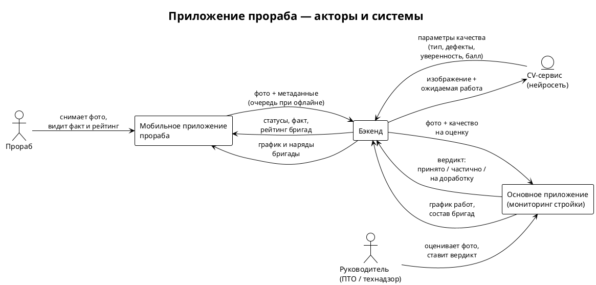
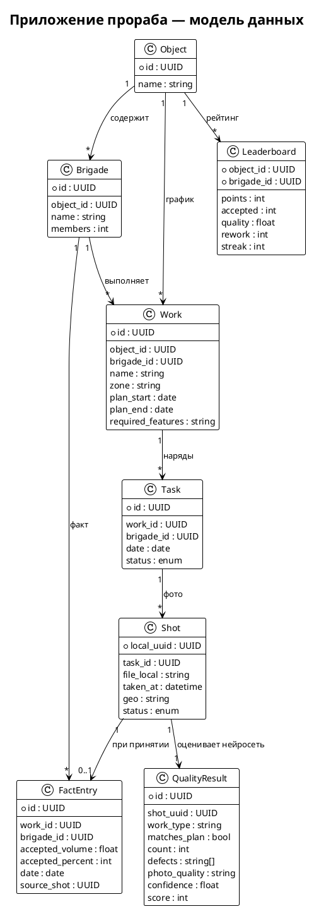
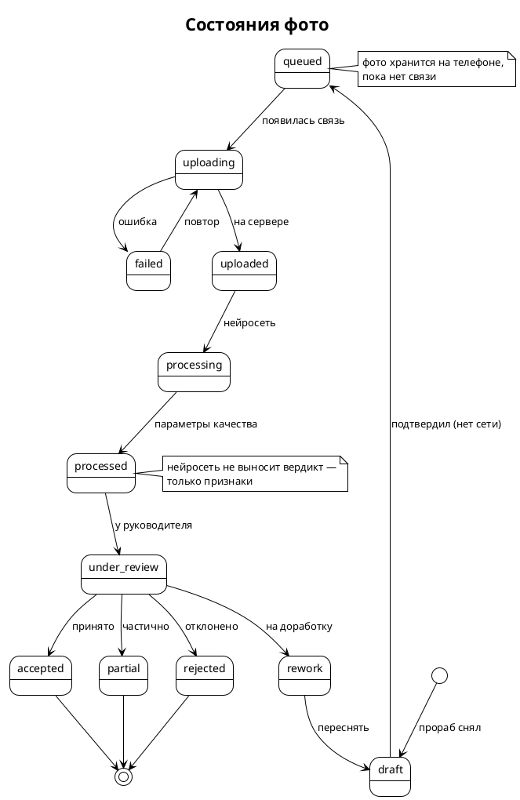

# Приложение прораба — бизнес-логика (системный анализ)

> **Для кого:** команда (бэк, фронт, ML, презентация).
> **Связанные документы:** `TZ.md`, `docs/REQUIREMENTS.md`, основное приложение мониторинга.

---

## 1. Назначение

Мобильное приложение для прораба, которое:
- получает **график работ** из основного приложения (мониторинга стройки);
- позволяет **быстро сфотографировать** результат работы (например, установку дверей);
- работает **без интернета**: фото хранится на телефоне и досылается позже;
- передаёт фото в **нейросеть**, а её параметры качества — в основное приложение;
- после **оценки руководителя** формирует **график фактически выполненных работ**;
- показывает **соревнование бригад** на объекте.

## 2. Три принципа

1. **Офлайн-ферст.** Фото сохраняется локально **до** любой отправки. Интернет не обязателен в момент съёмки.
2. **Минимум действий.** Один тап — одно фото. Никаких обязательных форм и текстовых полей.
3. **Прозрачное соревнование.** Бригады видят принятые работы друг друга на объекте.

---

## 3. Акторы и системы



| Актор / система | Роль |
|-----------------|------|
| **Прораб** | снимает фото, ведёт свой факт, видит соревнование |
| **Руководитель** | оценивает фото, ставит вердикт |
| **Мобильное приложение** | съёмка, офлайн-очередь, факт, рейтинг |
| **Бэкенд** | приём фото, связь с нейросетью и основным приложением |
| **CV-сервис (нейросеть)** | распознаёт работу, отдаёт параметры качества |
| **Основное приложение** | источник графика, приёмка, факт, рейтинг |

---

## 4. Модель данных



**Ключ идемпотентности:** `Shot.local_uuid` генерируется на телефоне. Одно фото не отправится дважды и не потеряется.

---

## 5. Основной сценарий (сквозной)

1. Прораб открывает приложение → **«Сегодня»**: работы своей бригады из графика.
2. Тапает работу → кнопка **«Фото»**. Снял (можно несколько).
3. Фото сразу в **локальной очереди** (`queued`), к нему привязаны задача, время, гео.
4. Нет интернета — фото лежит. Появился — **фоновая отправка**.
5. Бэкенд прогоняет фото через **нейросеть** → сохраняет **параметры качества**.
6. Руководитель в основном приложении видит фото + качество → **вердикт**.
7. Формируется **факт**: работа появляется в графике выполненных у прораба и в основном приложении.
8. Обновляется **соревнование**.

---

## 6. Жизненный цикл фото (state machine)



| Состояние | Значение |
|-----------|----------|
| `draft` | снято, не подтверждено к отправке |
| `queued` | в локальной очереди (нет сети) |
| `uploading` / `failed` | отправляется / ошибка (повтор) |
| `uploaded` / `processing` / `processed` | на сервере / нейросеть / есть качество |
| `under_review` | у руководителя |
| `accepted` / `partial` / `rework` / `rejected` | вердикт |

**Правило:** фото **никогда не удаляется** при неудаче — только повтор.

---

## 7. Офлайн-режим (ключевая часть)

- **Хранилище:** локальная БД (метаданные) + файлы фото на телефоне.
- **Очередь:** FIFO по `local_uuid`, повтор с экспоненциальной задержкой.
- **Сжатие:** на телефоне, «среднее» качество (прорабу некогда — нейросеть терпит).
- **Триггеры отправки:** появилась связь / Wi-Fi / открыл приложение / вручную.
- **Батч:** несколько фото за раз (экономия трафика и батареи).
- **Идемпотентность:** повтор `local_uuid` не создаёт дубль.
- **Лимит хранилища:** предупреждение; неотправленное не удаляем молча.
- **Индикатор:** «не отправлено: N фото» — без технических деталей.

---

## 8. Параметры качества от нейросети

Нейросеть получает фото + ожидаемую работу и возвращает:

| Параметр | Пример |
|----------|--------|
| `work_type` | «установка дверей» |
| `matches_plan` | да / нет / не уверен |
| `count` | 3 двери |
| `defects[]` | «зазор», «перекос», «не закончено» |
| `photo_quality` | «размыто», «темно», «издалека» |
| `confidence` | 0.0–1.0 |
| `score` | 0–100 |

**Правило:** нейросеть даёт **признаки**, а не вердикт. Решение — за руководителем (принцип основного приложения: «система фиксирует, не утверждает»).

---

## 9. Оценка руководителя → формирование факта

1. Руководитель видит фото, распознанную работу, дефекты, качество, привязку к наряду.
2. Вердикт: **принято / частично / на доработку / отклонено** (+ комментарий).
3. «Принято/частично» → создаётся `FactEntry`, обновляется факт в основном приложении (Ось 2 «отчётность»), начисляются баллы.
4. «На доработку» → задача возвращается прорабу с причиной и штрафом в рейтинге.

**Связка с основным приложением:** фото + оценка = доказательство для правила **R6 «ложное завершение»** (заявлено 100 %, подтверждения нет).

---

## 10. График фактически выполненных работ (у прораба)

Простая лента по дням, статусы: **не начато · в работе · на проверке · принято** (+ «на доработку»).

```
Сегодня, 21 сентября
✅ Установка дверей, зона 2      принято · 12:40
⏳ Бетонирование, секция C        на проверке
🔁 Армирование, зона A            на доработку (переснять)
•  Котлован, зона B               не начато
```

Проценты и суммы считает система — прораб их не заполняет.

---

## 11. Соревнование бригад

```
Бригада          Принято   Качество   Баллы
Бригада №2         14       92%       178
Бригада №1 (мы)    12       88%       150
Бригада №3          9       75%       104
```

**Метрики:** `accepted`, `quality`, `timeliness`, `rework` (штраф), `streak` (дней без брака).

**Формула (пример):**
```
points = accepted × 10 + quality_bonus − rework × 5
```

**Этика:** видно **работы и зоны** других бригад, но **без фото и личных данных** — соревнование, а не слежка.

---

## 12. Экраны (минимум — три)

1. **«Сегодня»** — работы бригады на сегодня, одна кнопка **«Фото»** у каждой; счётчик «в очереди: N».
2. **«Мои отчёты»** — лента по дням со статусами; у «на доработку» — «переснять».
3. **«Соревнование»** — таблица бригад объекта.

**Правило дизайна:** на главном экране одно действие — фото. Остальное — просмотр.

---

## 13. API-контракты (обмен)

**Скачивание (сервер → телефон):**
```
GET /api/foreman/object/{id}/schedule?brigade_id=...&date=...
GET /api/foreman/leaderboard?object_id=...
```

**Загрузка (телефон → сервер):**
```
POST /api/foreman/shots        # multipart: фото + метаданные
  { local_uuid, task_id, taken_at, geo }
→ 201 { server_id, status: "uploaded" }
```

**Статусы (телефон ← сервер):**
```
GET /api/foreman/shots/status?uuids=...
→ [{ local_uuid, status, quality_result?, verdict? }]
```

Обязательно: идемпотентность по `local_uuid`; сервер не создаёт дубли.

---

## 14. Права и безопасность

- Прораб видит **только свой объект и свою бригаду** (+ агрегированный рейтинг).
- Фото защищены, доступ — по объекту/бригаде.
- Простая идентификация прораба (телефон/код), без сложных кабинетов.

---

## 15. Краевые случаи

| Случай | Решение |
|--------|---------|
| Фото без выбранной работы | привязать к ближайшей задаче дня или «прочее» — не терять |
| Нейросеть не распознала | «не уверен» → руководитель решает вручную |
| Вердикт «на доработку» | задача возвращается с причиной и штрафом |
| Дубль фото | отсекается по `local_uuid` |
| Долго нет сети | фото копятся; предупреждение о заполнении памяти |
| Появилась связь | батч-отправка |
| Закрыто в графике, фото нет | сценарий **«ложное завершение»** |

---

## 16. Критерии приёмки

1. **Фото не теряется** — снято офлайн, доедет после включения интернета.
2. **≤ 2 тапов** до отправки фото.
3. Нейросеть отдаёт параметры качества; руководитель их видит.
4. После вердикта факт появляется **и** у прораба, **и** в основном приложении.
5. Рейтинг бригад обновляется; прораб видит работы других бригад.
6. Прораб не заполняет ни одного текстового поля.
7. Работает на слабой связи (батчи, индикатор очереди).

---

## 17. Открытые вопросы

1. Формула баллов соревнования — утвердить.
2. Что видно о других бригадах: только работы/зоны или с фото? (предлагаю без фото — этика).
3. Нейросеть на **сервере** (рекомендуется) или на телефоне.
4. Сжатие фото: баланс качество ↔ трафик.
5. Защита от накрутки: правило «1 наряд = N фото», дедуп.

---

## Схемы

Код PlantUML для рендера: `docs/diagrams/`
- `foreman-actors.puml` — акторы и системы
- `foreman-data-model.puml` — модель данных
- `foreman-photo-lifecycle.puml` — жизненный цикл фото

Отрендерить: вставить на https://www.plantuml.com/plantuml/uml/ или в расширение PlantUML (VS Code).
